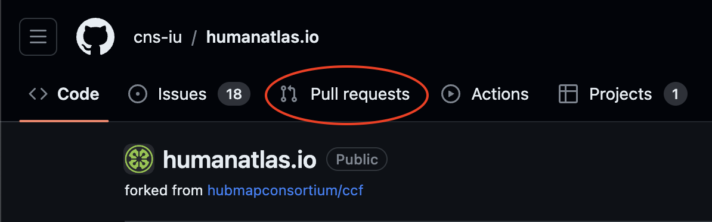
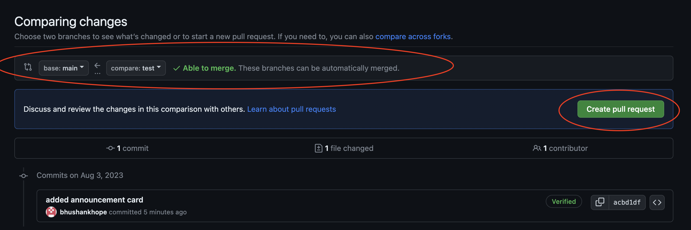

### Steps to Add/Edit YAML Files

1. Open https://humanatlas.io/
2. Navigate to the page that needs to be updated and copy the route.

3. Open https://github.com/cns-iu/humanatlas.io

2. In the URL, update '.com' with '.dev'. (https://github.com/cns-iu/humanatlas.io -> https://github.dev/cns-iu/humanatlas.io)

3. If not installed, install the YAML Extenstion (search 'redhat.vscode-yaml' in Extensions Marketplace)

4. Navigate to Source Control and create a new branch off the main/develop branch.

5. Enter your branch name and press Enter

6. Select the reference branch(main/develop) for your new branch and click 'Switch to Branch' to switch to your new branch.

7. Navigate to src/assets/content/pages in the directory and open the YAML file with the same name as the route copied earlier.

8. Type '- type:' and hit enter. You will be recommended with the list of the components which you can add.

9. Select the component you want to add. Hover over the component name for the description of the component.

10. If you see any error, hover over it to see what fields are missing and add them accordingly.

11. Once you are done with adding the new component, head back to Source Control. Add a commit message and push it to your branch.

12. Navigate back to https://github.com/cns-iu/humanatlas.io and click on Pull Requests tab

13. Click on New Pull Request.
- Select cns-iu/humanatlas.io as base repository.
- Select main/develop as base branch.
- Select your branch as compare branch
- Click on Create Pull Request

14. Add comments if any and click on Create Pull Request