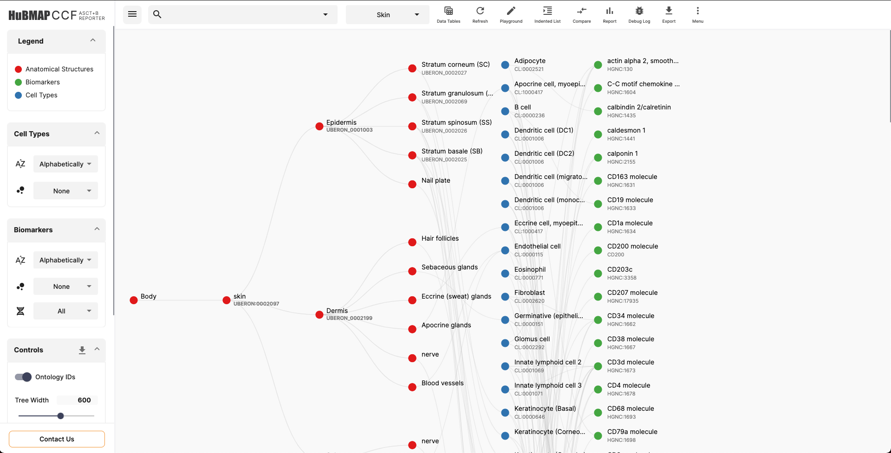
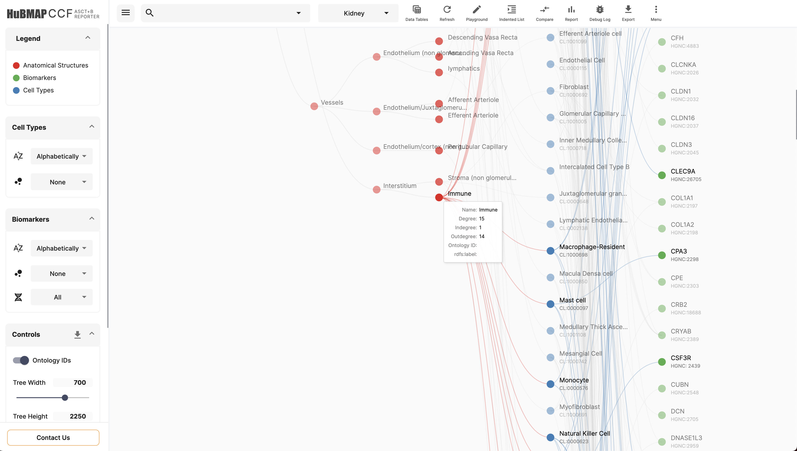
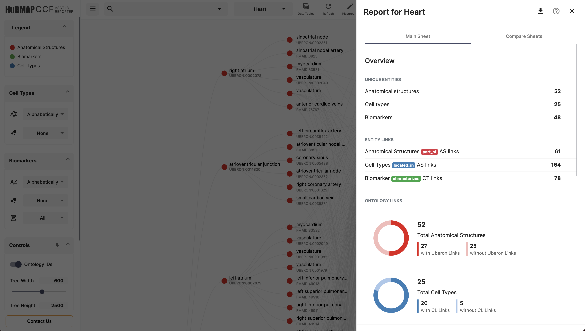
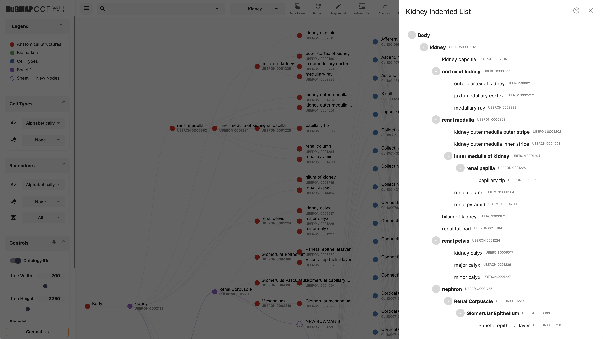
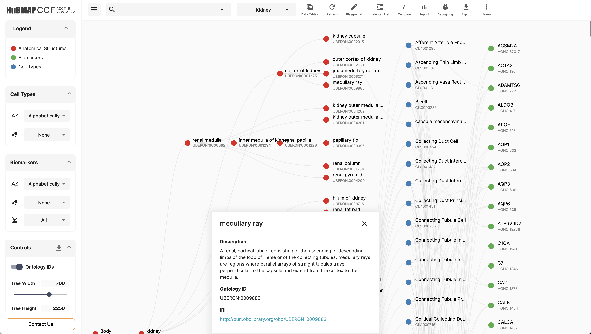

### ASCT+B API

The reporter is also accompanied by a backend server ASCT+B API. In the event of Google Sheets blocking requests by the Reporter or any error, the Reporter fetches the data from the ASCT+B API which runs a simple Node script to fetch the data from Google Sheets. By supplying the SheetId and GID to the ASCT+B API, the data from the flattened tables can be retrieved. If for some reason the ASCT+B API also fails to retrieve the data, the Reporter falls to its system cache, which contains a snapshot of the flattened tables.

The Miner can also be used as a stand-alone tool to retrieve the data from the flattened Google sheets. Below is the API that you'll have to use,

```
https://asctb-api.herokuapp.com/asctb-reporter/<sheetID>/<gid>
```

This will either return the data, or will return a `500` HTTP code.

### Usage

Use the following commands to lint, build and run the app

```shell
# lint
$ npx nx run asctb-api:lint

# build
$ npx nx run asctb-api:build

# serve
$ npx nx run asctb-api:serve

#test
$ npx nx run asctb-api:test
```

#### Deploying

Since the ASCT+B API is a dynamic script, Heroku has been used to deploy the server. Heroku is free to use for this usage. Deployment is accomplished via GitHub Actions based on the branch. The `main` branch deploys to production and `develop` deploys to staging.

## Screenshots of the ASCT+B Reporter

Visualization



Hovering over a node



Clicking on a node


Report



Indented List



Info Sheet


