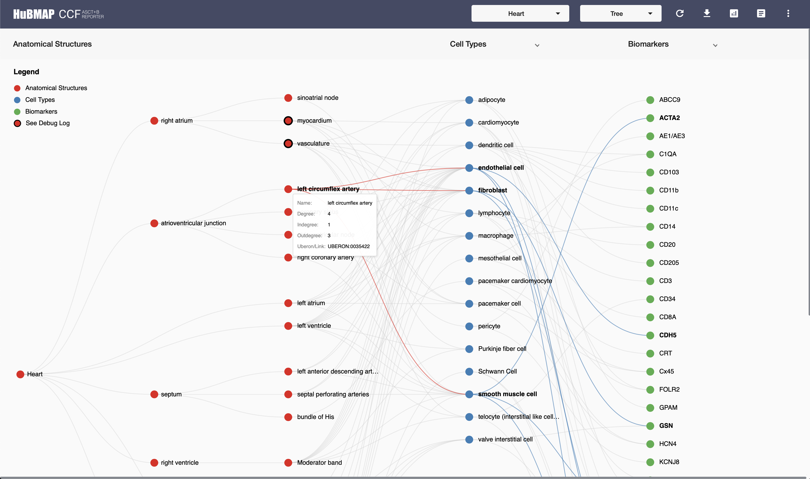
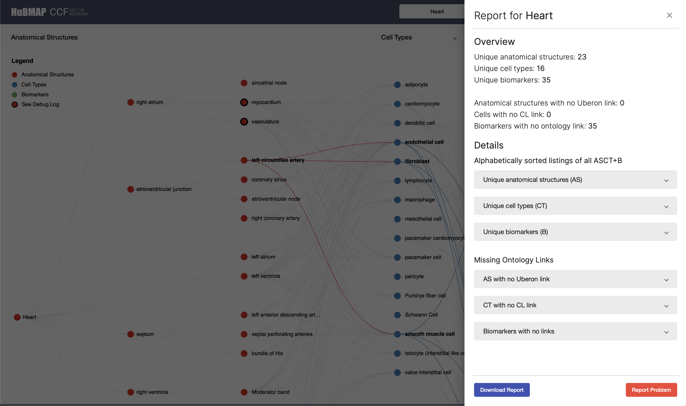

# Portal Pull Request Document

## Preview

In menu use title **Anatomical Structures, Cell Types, and Biomarkers Tables**,

## Description

ASCT+B tables represent anatomical structures (AS), their major cell types (CT) and biomarkers (B) used to identify cell types as identified by organ experts. The tables support common coordinate framework (CCF) design and usage, see [CCF Portal](https://hubmapconsortium.github.io/ccf/).

The [CCF ASCT+B Reporter](https://hubmapconsortium.github.io/ccf-asct-reporter/) is a visualization tool for displaying ASCT+B tables. It was built using Angular and Vega. Visualizations comprise a partonomy tree of anatomical structures that is linked with their respective cell types and biomarkers via bimodal networks. The nodes in the bimodal networks can be size-coded by their number of links (in degree, out degree, and total degree). They can be sorted by node degree or alphabetically by node label.

In addition, the reporter provides downloadable reports that tabulate counts, unique anatomical structures, cell types, and biomarker lists, and information on missing information for the ASCT+B tables. The visualizations can be saved out in PNG or SVG format but also as a Vega specification that defines an interactive visualization in JSON format.

**Title:** ASCT+B Reporter

**Group Name:** MC-IU at Indiana University

**Created by user:** Hrishikesh Paul, Bruce W. Herr II, Katy Börner

**Created by username:** hrpaul@iu.edu, bherr@iu.edu, katy@iu.edu

## Screenshot

