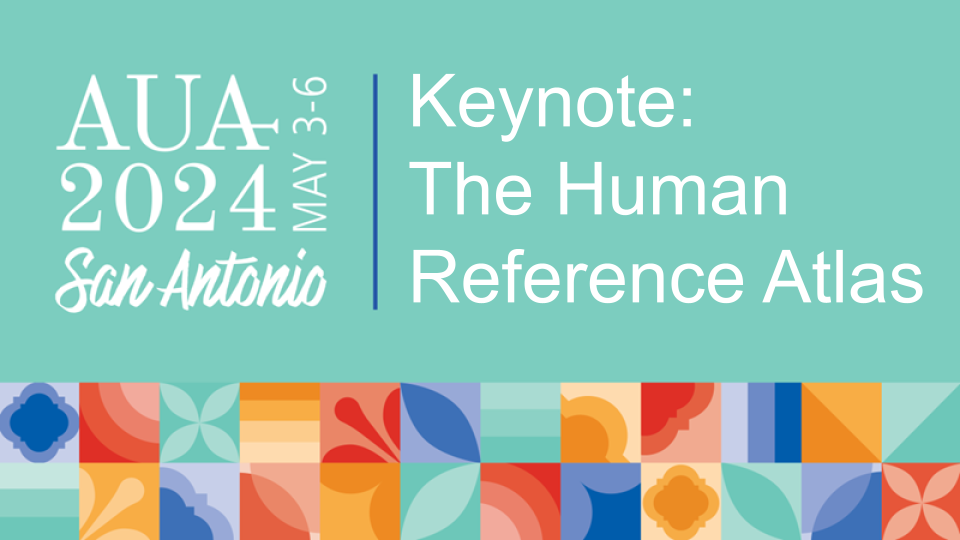

# AUA2024 HRA Keynote Resources

[Keynote Slides](assets/AUA2024-human-ref-atlas-herr.pdf)

On Sunday, May 5th, 2024, [Bruce W. Herr II](https://orcid.org/0000-0002-6703-7647) presented the Keynote Address: "_The Human Reference Atlas_" at the [_AUA2024 Basic Sciences Symposium_](https://aua2021.app.swapcard.com/event/2024-annual-meeting-san-antonio/planning/UGxhbm5pbmdfMTczMDU1Nw==) in San Antonio, Texas. This resource site provides links to resources referenced in the Keynote and potentially relevant to the urology community.

More information about the Human Reference Atlas can be found at <https://humanatlas.io>. Contact [infoccf@iu.edu](mailto:infoccf@iu.edu) for information on how to join the HRA Working Group.

## Atlas Resources

### Anatomical Structures, Cell Types, and Biomarkers (ASCT+B) Tables

Anatomical Structures, Cell Types, and Biomarkers (ASCT+B) tables aim to capture the nested part_of structure of anatomical human body parts, the typology of cells, and the biomarkers used to identify cell types (e.g., gene, protein, lipid or metabolic markers). The tables are authored and reviewed by an international team of anatomists, pathologists, physicians, and other experts. More information is at <https://humanatlas.io/asctb-tables>.

ASCT+B Tables can be visualized and reviewed using the ASCT+B Reporter tool at <https://hubmapconsortium.github.io/ccf-asct-reporter/>. Links below take you to visualizations of individual ASCT+B tables for specific organs.

- [Kidney](https://hubmapconsortium.github.io/ccf-asct-reporter/vis?selectedOrgans=kidney-v1.4&playground=false)
- [Ureter](https://hubmapconsortium.github.io/ccf-asct-reporter/vis?selectedOrgans=Ureter-v1.0&playground=false)
- [Urinary Bladder](https://hubmapconsortium.github.io/ccf-asct-reporter/vis?selectedOrgans=Urinary_Bladder-v1.0&playground=false)
- [Prostate](https://hubmapconsortium.github.io/ccf-asct-reporter/vis?selectedOrgans=Prostate-v1.1&playground=false)
- [Uterus](https://hubmapconsortium.github.io/ccf-asct-reporter/vis?selectedOrgans=Uterus-v1.1&playground=false)

### 3D Reference Organs

3D reference organs are 3D-modeled organs from the human body. They are modeled primarily with the Visual Human Project male and female and shaped by professional medical illustrators in collaboration with subject matter experts. Additionally, each part of the 3D-modeled organ has been ontologically tagged, usually Uberon terms, to unambigously identify the pieces. Models are made available in .glb format and can be readily viewed with a large variety of 3D model viewers. [More Information](https://humanatlas.io/3d-reference-library).

- [Kidney](https://humanatlas.io/3d-reference-library?version=2.0&organ=Kidney)
- [Ureter](https://humanatlas.io/3d-reference-library?version=2.0&organ=Ureter)
- [Urinary Bladder](https://humanatlas.io/3d-reference-library?version=2.0&organ=Urinary%20Bladder)
- [Prostate](https://humanatlas.io/3d-reference-library?version=2.0&organ=Prostate)
- [Uterus](https://humanatlas.io/3d-reference-library?version=2.0&organ=Uterus)

### 2D Functional Tissue Unit (FTU) Illustrations

2D FTU Illustrations are illustrated views of how certain cells interact and link to each other to perform a function. These illustrations are created by professional medical illustrators in collaboration with subject matter experts. Additionally, each cell has been ontologically tagged, usually with Cell Ontology terms, to unambigiously identify cells in the illustrations. Illustrations are available in .svg format and can be readily viewed with a large variety of applications. [More Information](https://humanatlas.io/2d-ftu-illustrations).

- [Kidney](https://humanatlas.io/2d-ftu-illustrations?version=2.0&organ=Kidney)
- [Prostate](https://humanatlas.io/2d-ftu-illustrations?version=2.0&organ=Prostate)

### Organ Mapping Antibody Panels (OMAPs)

Organ Mapping Antibody Panels (OMAPs) are collections of antibodies that allow spatial mapping of the anatomical structures and cell types present in diverse organs using multiplexed antibody-based imaging (Hickey et al, 2021). [More Information](https://humanatlas.io/omap).

- [Kidney](https://humanatlas.io/omap) (OMAP-3 and OMAP-9)

### Vascular Geometries (VCCF)

The VCCF is the first open, computer-readable, and comprehensive database of the adult human blood vasculature. It contains a list of blood vessels and their branching relationships, as well as associated cell types and biomarkers, the vessel type, anastomoses, portal systems, microvasculature, functional tissue units, links to 3D reference objects, vessel geometries (length, diameter), and mappings to anatomical structures the vessels supply or drain. [More Information](https://humanatlas.io/vccf).

- VCCF Video: <https://youtu.be/zQeMgxo8n_U>

### Experimental Data (Donors, Tissues, Datasets)

Data can be registered to the HRA by creating an extraction site via the [Registration User Interface](https://apps.humanatlas.io/rui/) and publishing metadata around it, including donors, tissue blocks, tissue sections, and datasets associated with that extraction site. This data can then be federated alongside many other consortias' datasets.

- [Kidney, Ureter, Urinary Bladder, Prostate, and Uterus data mapped to the HRA](./eui.html)
- HuBMAP Data Portal: <https://portal.hubmapconsortium.org>
- HuBMAP Data Registered to the HRA: <https://portal.hubmapconsortium.org/ccf-eui>
- All data federated and registered to the HRA: <https://apps.humanatlas.io/eui/>

### HRApop Data (Datasets and Cell Summaries)

HRApop analyzes experimental data that have cell by gene data and informs the atlas. It is primarily used in two official HRA User Stories, [US#1](https://humanatlas.io/user-story/1) and [US#2](https://humanatlas.io/user-story/2).

- HRApop Data: <https://purl.humanatlas.io/graph/hra-pop>

### HRAlit Data (Publications, Authors, Funders)

HRAlit mines PubMed for publications, authors, organizations, and funding related to HRA authors, organs, and topics.

- HRAlit v0.5: <https://github.com/cns-iu/hra-literature>

### HRA Knowledge Graph

All HRA data is captured as digital objects, normalized to RDF graphs, and published as Linked Open Data. This is the HRA Knowledge Graph (HRA-KG).

- HRA-KG: <https://lod.humanatlas.io>
- SPARQL Endpoint: <https://api.triplydb.com/s/N3XfglUL5>

# Contact Us

- Website: <https://cns.iu.edu>
- Email: [infoccf@iu.edu](mailto:infoccf@iu.edu)
- Twitter: <https://twitter.com/cnscenter>
- LinkedIn: <https://www.linkedin.com/company/cns-indiana-university-bloomington/>
